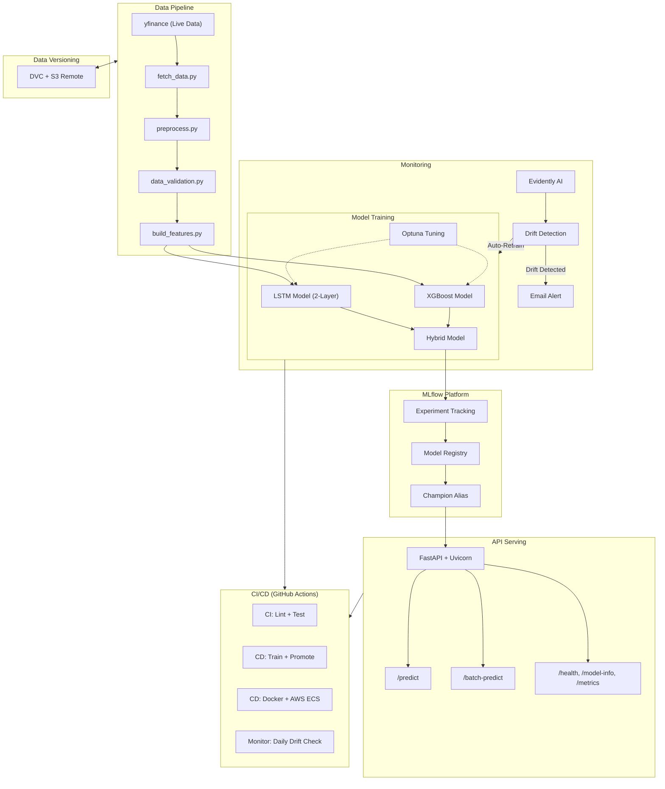

# Crypto & Stock Price Prediction MLOps Pipeline

[](https://github.com/orhansonmeztr/crypto-stock-mlops-pipeline/actions/workflows/ci-pipeline.yml)
[](https://www.python.org/downloads/)
[](https://github.com/astral-sh/ruff)
[](https://mlflow.org/)
[](https://dvc.org/)
[](https://www.docker.com/)

Production-ready MLOps pipeline for cryptocurrency and stock price prediction using a Hybrid LSTM + XGBoost model. This project demonstrates end-to-end MLOps capabilities including automated training, experiment tracking, model monitoring, CI/CD, and API serving.

## Project Goals

- Production-grade ML engineering with modular code and tests.
- End-to-end automation of training, evaluation, and deployment.
- Hybrid modeling combining LSTM for temporal patterns and XGBoost for feature-based prediction.
- MLOps best practices with MLflow, DVC, drift detection, and CI/CD.

## Architecture



## Features

- Hybrid architecture: LSTM + XGBoost for robust time-series forecasting.
- Automated CI/CD with GitHub Actions.
- MLflow experiment tracking and model registry (Local & Databricks / Unity Catalog).
- Model performance monitoring with automatic threshold checks and **SMTP Email Alerts**.
- Champion/Challenger model promotion strategy.
- RESTful API with FastAPI, secured via API Key and **Rate Limiting** (`slowapi`).
- Full Dockerization with Docker & Docker Compose.
- Hyperparameter tuning with Optuna.

## Tech Stack

- **ML Frameworks:** TensorFlow/Keras (LSTM), XGBoost, Scikit-Learn
- **MLOps:** MLflow, DVC, Evidently AI, Optuna
- **API & App:** FastAPI, Uvicorn, Pydantic
- **Infrastructure:** Docker, Docker Compose, GitHub Actions
- **Code Quality:** Ruff, Pre-commit, Pytest, UV (Package Manager)

## Setup & Installation

### Prerequisites

- Python 3.12+
- Docker Desktop
- Git
- [uv](https://github.com/astral-sh/uv) (recommended Python package manager)

### 1. Local Setup

```bash
# Clone repository
git clone https://github.com/orhansonmeztr/crypto-stock-mlops-pipeline.git
cd crypto-stock-mlops-pipeline

# Create virtual environment & install dependencies
uv venv --python 3.12
uv sync --all-extras --dev

# Activate environment (Linux/Mac)
source .venv/bin/activate

# Pull dataset using DVC (must use --env-file to load AWS S3 credentials)
uv run --env-file .env dvc pull
```

### 2. Environment Variables

Copy `.env.example` to `.env` and configure the following variables.

**Note:** `AWS_*` keys are required for DVC data versioning.

```bash
# MLflow Configuration
DATABRICKS_HOST="https://your-workspace-uri.cloud.databricks.com"
DATABRICKS_TOKEN="your_databricks_token"
DATABRICKS_EXPERIMENT_PATH="/Users/your-email@example.com/crypto-stock-prediction"
DATABRICKS_EXPERIMENT_PATH_MONITORING="/Users/your-email@example.com/crypto-stock-monitoring"
DATABRICKS_CATALOG="workspace"
DATABRICKS_SCHEMA="default"
MLFLOW_TRACKING_URI="databricks"

# API Configuration
API_HOST="0.0.0.0"
API_PORT="8000"
API_KEY="your_secure_api_key"

# Data Configuration
DATA_SOURCE="yfinance"

# Email Alert Configuration (for drift detection)
SMTP_HOST="smtp.gmail.com"
SMTP_PORT="587"
SMTP_USER="your_email@gmail.com"
SMTP_PASSWORD="your_app_password"
ALERT_EMAIL_TO="alert_recipient@example.com"

# AWS keys
AWS_ACCESS_KEY_ID="your_aws_access_key_id"
AWS_SECRET_ACCESS_KEY="your_aws_secret_access_key"
AWS_DEFAULT_REGION="us-west-2"

# AWS ECS Deployment (optional)
AWS_ECR_REGISTRY="123456789.dkr.ecr.us-west-2.amazonaws.com"
AWS_ECS_CLUSTER="your-ecs-cluster"
AWS_ECS_SERVICE="crypto-stock-api"
```

### 3. Running with Docker

```bash
docker-compose up --build
```
Access the API docs at:
- Swagger UI: http://127.0.0.1:8000/docs
- Health check: http://127.0.0.1:8000/health

## Pipeline Usage

### Pipeline Execution (DVC)

The entire data and training pipeline is orchestrated via DVC (`dvc.yaml`). You can run the complete workflow (fetch -> preprocess -> validate -> build_features -> train) in one step:
```bash
uv run --env-file .env dvc repro
```

Alternatively, you can run individual scripts:
```bash
uv run python src/data/fetch_data.py # Fetch live data from yfinance
uv run python src/data/preprocess.py # Clean raw data
uv run python src/data/data_validation.py # Run strict data validation
uv run python src/features/build_features.py # Generate technical indicators and lags
```

### Hyperparameter Tuning (Optional)

```bash
uv run python src/training/tune.py
```
This runs Optuna, finds the best hyperparameters, and saves them to `configs/best_params.json`.

### Model Training & Promotion

```bash
# Train hybrid models for all configured assets
uv run python src/training/train.py

# Validate latest model performance
uv run python src/monitoring/model_performance.py

# Promote best models to 'Champion' alias in MLflow registry
uv run python src/training/promote_model.py
```

### Monitoring & Drift Detection

```bash
# Check for data drift between reference and current data
uv run python src/monitoring/drift_detection.py
```

### Testing

```bash
# Run unit tests
uv run pytest tests/unit/

# Run integration tests
uv run pytest tests/integration/
```

### Serving (API)

```bash
uv run python src/api/run.py
```

Then call the API:
```bash
curl -X POST "http://127.0.0.1:8000/predict" \
     -H "Content-Type: application/json" \
     -H "X-API-Key: your_secure_api_key" \
     -d '{
  "asset_name": "BTC-USD",
  "features": [
    {"return": 0.01, "log_return": 0.0095, "ma_3": 90000.0, "ma_7": 89000.0, "ma_14": 88000.0, "macd": 100.0, "macd_signal": 90.0, "macd_diff": 10.0, "rsi": 50.0, "bb_high": 92000.0, "bb_low": 86000.0, "bb_width": 0.06, "bb_position": 0.5, "volatility_7": 1000.0, "lag_1": 89000.0, "lag_2": 88000.0, "lag_3": 87000.0, "close": 90000.0},
    {"return": 0.02, "log_return": 0.0198, "ma_3": 91000.0, "ma_7": 89500.0, "ma_14": 88500.0, "macd": 110.0, "macd_signal": 95.0, "macd_diff": 15.0, "rsi": 55.0, "bb_high": 93000.0, "bb_low": 86500.0, "bb_width": 0.065, "bb_position": 0.6, "volatility_7": 1050.0, "lag_1": 90000.0, "lag_2": 89000.0, "lag_3": 88000.0, "close": 91000.0},
    {"return": 0.01, "log_return": 0.0099, "ma_3": 91500.0, "ma_7": 90000.0, "ma_14": 89000.0, "macd": 120.0, "macd_signal": 100.0, "macd_diff": 20.0, "rsi": 58.0, "bb_high": 94000.0, "bb_low": 87000.0, "bb_width": 0.068, "bb_position": 0.65, "volatility_7": 1100.0, "lag_1": 91000.0, "lag_2": 90000.0, "lag_3": 89000.0, "close": 92000.0},
    {"return": -0.01, "log_return": -0.0101, "ma_3": 91000.0, "ma_7": 90500.0, "ma_14": 89500.0, "macd": 115.0, "macd_signal": 105.0, "macd_diff": 10.0, "rsi": 52.0, "bb_high": 94500.0, "bb_low": 87500.0, "bb_width": 0.07, "bb_position": 0.5, "volatility_7": 1150.0, "lag_1": 92000.0, "lag_2": 91000.0, "lag_3": 90000.0, "close": 91000.0},
    {"return": 0.02, "log_return": 0.0198, "ma_3": 92000.0, "ma_7": 91000.0, "ma_14": 90000.0, "macd": 125.0, "macd_signal": 110.0, "macd_diff": 15.0, "rsi": 60.0, "bb_high": 95000.0, "bb_low": 88000.0, "bb_width": 0.072, "bb_position": 0.7, "volatility_7": 1120.0, "lag_1": 91000.0, "lag_2": 92000.0, "lag_3": 91000.0, "close": 93000.0},
    {"return": 0.01, "log_return": 0.0099, "ma_3": 92500.0, "ma_7": 91500.0, "ma_14": 90500.0, "macd": 130.0, "macd_signal": 115.0, "macd_diff": 15.0, "rsi": 62.0, "bb_high": 95500.0, "bb_low": 88500.0, "bb_width": 0.075, "bb_position": 0.75, "volatility_7": 1140.0, "lag_1": 93000.0, "lag_2": 91000.0, "lag_3": 92000.0, "close": 94000.0},
    {"return": 0.00, "log_return": 0.0000, "ma_3": 93000.0, "ma_7": 92000.0, "ma_14": 91000.0, "macd": 135.0, "macd_signal": 120.0, "macd_diff": 15.0, "rsi": 60.0, "bb_high": 96000.0, "bb_low": 89000.0, "bb_width": 0.076, "bb_position": 0.7, "volatility_7": 1160.0, "lag_1": 94000.0, "lag_2": 93000.0, "lag_3": 91000.0, "close": 94000.0},
    {"return": -0.01, "log_return": -0.0101, "ma_3": 92500.0, "ma_7": 92000.0, "ma_14": 91500.0, "macd": 130.0, "macd_signal": 125.0, "macd_diff": 5.0, "rsi": 55.0, "bb_high": 96000.0, "bb_low": 89500.0, "bb_width": 0.076, "bb_position": 0.5, "volatility_7": 1200.0, "lag_1": 94000.0, "lag_2": 94000.0, "lag_3": 93000.0, "close": 93000.0},
    {"return": 0.02, "log_return": 0.0198, "ma_3": 93500.0, "ma_7": 92500.0, "ma_14": 92000.0, "macd": 140.0, "macd_signal": 130.0, "macd_diff": 10.0, "rsi": 62.0, "bb_high": 96500.0, "bb_low": 90000.0, "bb_width": 0.078, "bb_position": 0.8, "volatility_7": 1250.0, "lag_1": 93000.0, "lag_2": 94000.0, "lag_3": 94000.0, "close": 95000.0},
    {"return": 0.01, "log_return": 0.0095, "ma_3": 94500.0, "ma_7": 93000.0, "ma_14": 92500.0, "macd": 150.5, "macd_signal": 140.2, "macd_diff": 10.3, "rsi": 65.4, "bb_high": 97000.0, "bb_low": 91000.0, "bb_width": 0.08, "bb_position": 0.85, "volatility_7": 1280.0, "lag_1": 95000.0, "lag_2": 93000.0, "lag_3": 94000.0, "close": 96000.0}
  ]
}'
```


## Dataset

- **Source:** Yahoo Finance (via yfinance) - Live 5-year historical data
- **Features:** Open, High, Low, Close, Volume, Market Cap
- **Assets (Tickers):** `BTC-USD`, `ETH-USD`, `SOL-USD`, `AMZN`, `IBM`, `NVDA`

## Development Status

- Project setup and configuration
- Data pipeline implementation
- Model development (Hybrid LSTM+XGBoost)
- MLflow integration (Local & Unity Catalog)
- Hyperparameter tuning (Optuna)
- Model monitoring & promotion logic
- REST API development with FastAPI
- Docker & Docker Compose setup
- CI/CD pipelines (GitHub Actions)
- Documentation

## License

MIT License

## Author

**Orhan Sonmez**
- GitHub: [https://github.com/orhansonmeztr](https://github.com/orhansonmeztr)
